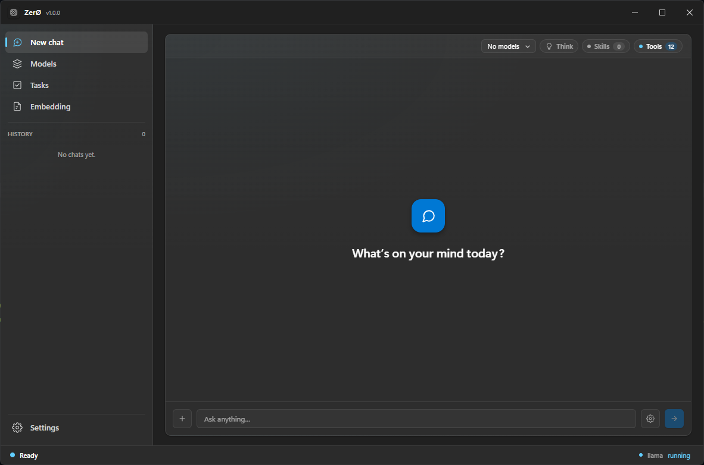
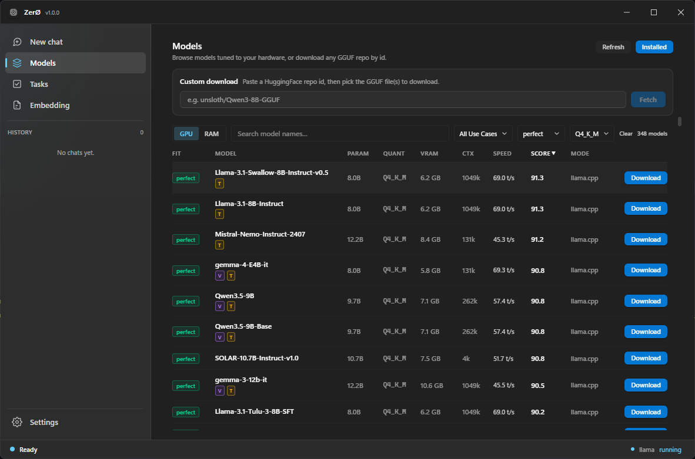
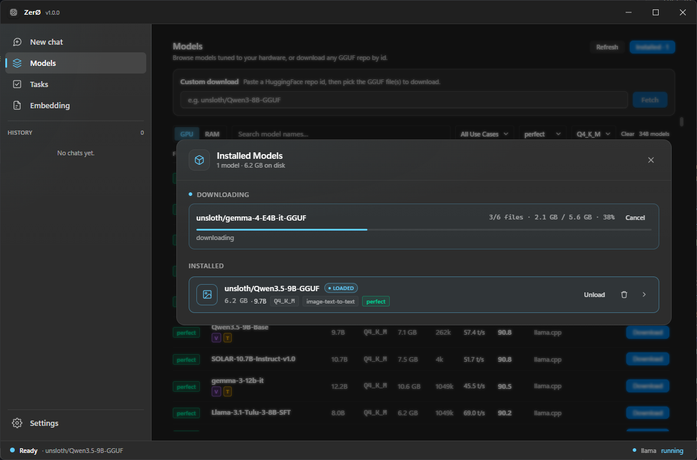
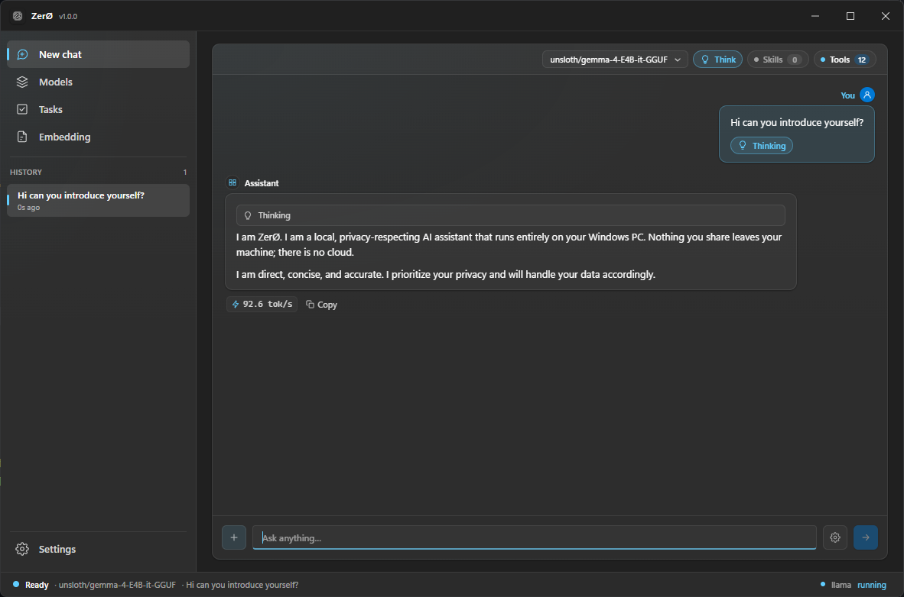
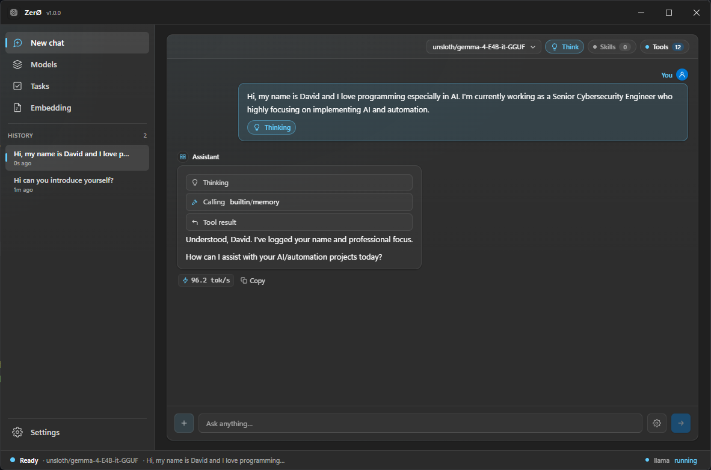
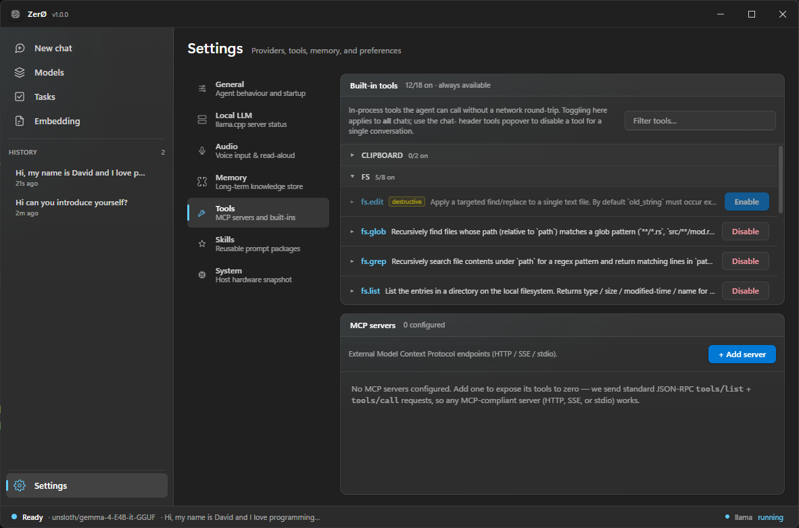
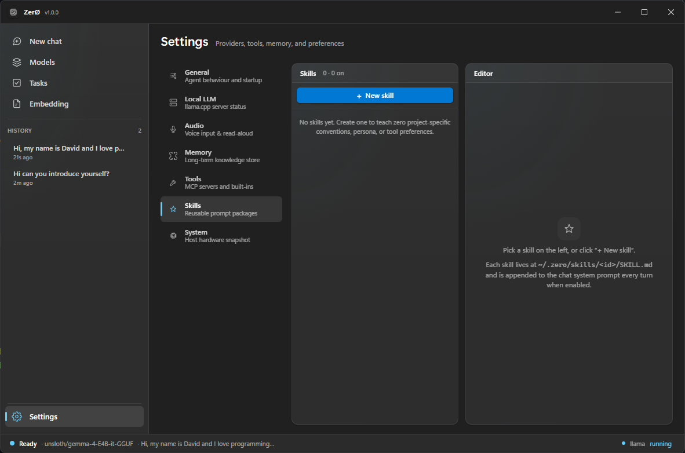
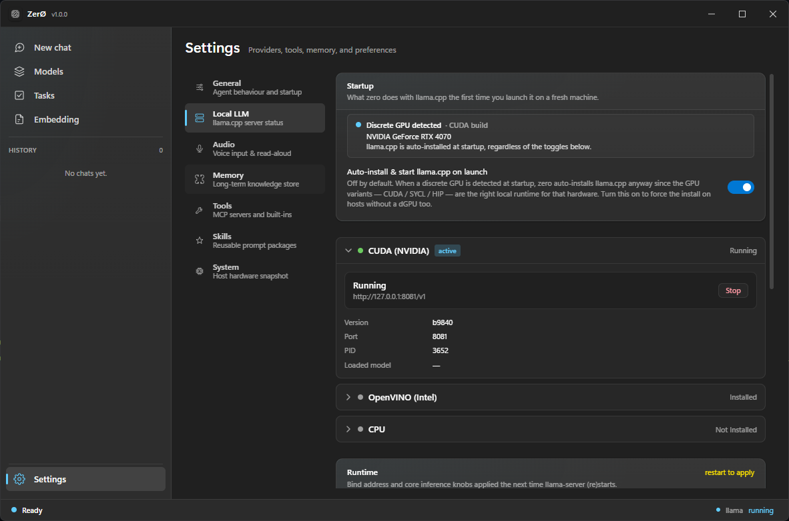
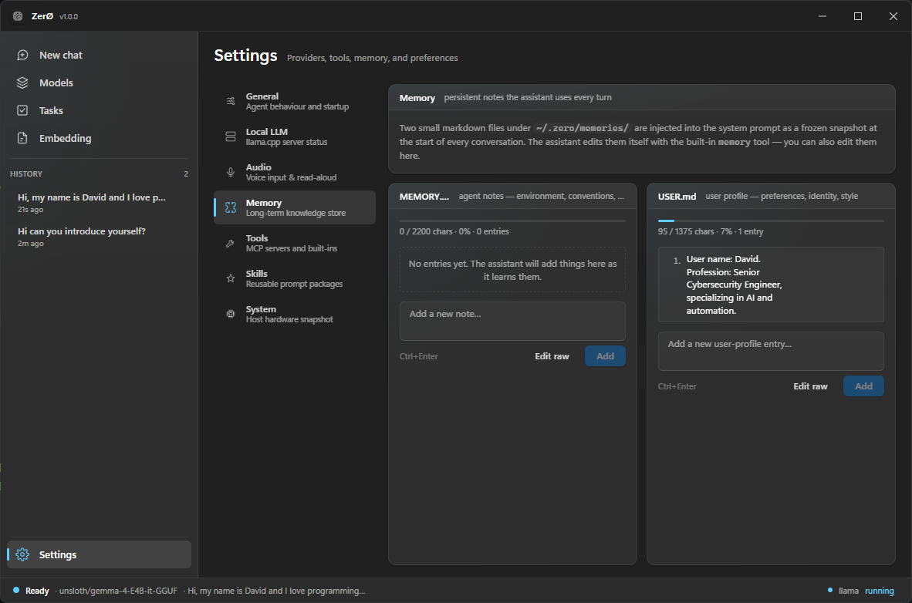
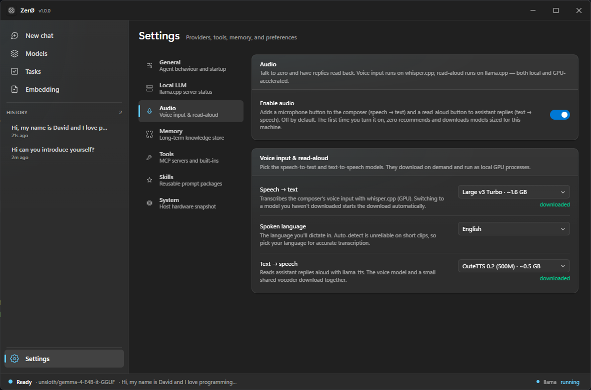

<div align="center">


# ZerØ

**A local agentic AI desktop app for Windows — from a low‑end Intel laptop to a high‑end discrete‑GPU rig.**

ZerØ auto‑detects your PC and installs the right `llama.cpp` build for it, so the same app runs well on an Intel‑only ultrabook *and* on a CUDA workstation. No cloud, no API keys, no terminal.

<br />



</div>

---

## Why ZerØ

| | |
| --- | --- |
| **Zero cloud** | Everything runs on your machine via `llama.cpp`. No servers, no egress. |
| **Zero billing** | No tokens, no API keys, no subscriptions. Your hardware is the only bill. |
| **Zero command line** | A full desktop UI — browse, download, chat, and run agents without a terminal. |
| **Zero config** | Auto-detects your hardware and installs the matching accelerated build. |
| **Zero telemetry** | Nothing about you or your data ever leaves the device. |

## Built for the whole Windows hardware spectrum

ZerØ probes your CPU, RAM, and GPU (with VRAM) on first launch, then provisions the fastest `llama.cpp` backend your machine can actually run — and recommends models that *fit*. You never pick a build by hand.

| Your PC | Backend ZerØ installs | What you get |
| --- | --- | --- |
| Intel CPU only (low-end / older laptops) | **OpenVINO** (CPU + iGPU) → **CPU** fallback | Runs small/quantized models smoothly on integrated hardware |
| Intel with Arc iGPU / dGPU | **OpenVINO** | Offloads to Intel graphics for a real speed-up |
| NVIDIA discrete GPU | **CUDA** | Full GPU acceleration on GeForce / RTX |
| AMD Radeon discrete GPU | **HIP / ROCm** | Full GPU acceleration on supported Radeon cards |
| Anything else | **CPU** | Universal fallback — it always runs |

Hardware-aware recommendations rank models by **memory fit** and **estimated tokens/sec** for your machine, across two modes: `gpu` (VRAM-bound, discrete GPU) and `ram` (CPU + iGPU + system RAM). Quantization is tunable from `Q8_0` down to `Q2_K`, defaulting to `Q4_K_M`.

## Features

- **System probe** — CPU / RAM / GPU + VRAM detection with fit-scored, tokens/sec-estimated model recommendations
- **One-click runtime** — installs the right `llama.cpp` variant; load and hot-swap GGUF models per backend
- **Model library** — browse Hugging Face and download exactly the GGUF files you need (no full-repo pulls)
- **Streaming chat** — persisted conversations with per-chat model pinning and sampling overrides
- **Multimodal** — image and document upload (OpenAI vision shape over the chat endpoint)
- **Skills** — user-authored agent skills in `~/.zero/skills/<id>/SKILL.md`, enabled per chat
- **Tools (MCP)** — built-in shell, fs, http, web search/read, clipboard, notify, and task.create, plus external MCP servers (HTTP/SSE) listed and smoke-tested from the Tools page
- **Knowledge base** — ground replies in your own documents (Embedding page)
- **Memory** — short-term and long-term persistent memory
- **Voice** — speech-to-text via `whisper.cpp` and text-to-speech via `llama-tts`
- **Scheduler** — cron, interval, and click-to-run agent tasks
- **Other providers** — point at ollama or any OpenAI-compatible endpoint; same chat UI, different base URL

## Screenshots

| Hardware-aware model library | Download & manage models |
| --- | --- |
|  |  |

| Reasoning trace (Thinking) | Memory-aware conversations |
| --- | --- |
|  |  |

| Agent tools (MCP) | Custom skills |
| --- | --- |
|  |  |

<details>
<summary>More screenshots</summary>

| Provider settings | Memory settings |
| --- | --- |
|  |  |

| Voice (STT / TTS) setup | |
| --- | --- |
|  | |

</details>

## Tech stack

| Layer | Choice |
| --- | --- |
| Runtime | [`llama.cpp`](https://github.com/ggml-org/llama.cpp) bundled `llama-server` (OpenAI-compatible) |
| Audio | [`whisper.cpp`](https://github.com/ggml-org/whisper.cpp) (STT) + `llama-tts` (TTS) |
| Shell | Tauri 2 (Rust) |
| Frontend | React 19 + Tailwind v4 (Fluent Design–inspired) |
| State | Zustand (front) · SQLite via `sqlx` (back) |

## Getting started

> **Platform:** Windows PC. ZerØ is designed and tuned specifically for Windows hardware detection and accelerator provisioning.

**Prerequisites:** [Node ≥ 20](https://nodejs.org) + [pnpm](https://pnpm.io), the [Rust toolchain](https://rustup.rs), and the [Tauri 2 prerequisites](https://v2.tauri.app/start/prerequisites/) (WebView2 + MSVC build tools).

```bash
pnpm install
pnpm tauri dev
```

Build a release bundle:

```bash
pnpm tauri build
```

Regenerate app icons (required for `tauri build`, not for `dev`):

```bash
pnpm tauri icon path/to/your-icon.png
```

## Project layout

| Path | Purpose |
| --- | --- |
| `src/` | React frontend (Fluent Design–inspired) |
| `src/pages/` | Top-level views (Chat, Models, Tasks, Embedding, Settings) |
| `src/stores/` | Zustand stores (one per domain) |
| `src/components/tui/` | Reusable UI primitives |
| `src-tauri/src/` | Rust backend (one module per domain) |
| `src-tauri/src/commands/` | Tauri IPC commands |

## Storage

Everything ZerØ creates lives under a single folder in your home directory:

```
~/.zero/
├── zero.db                      # SQLite (conversations, tasks, memory, runtime state)
├── system.json                  # Cached hardware probe
├── settings.json
├── runtimes/
│   ├── llama.cpp/<variant>/     # cuda | openvino | hip-radeon | cpu builds
│   │   ├── ov_cache/            # OpenVINO compiled-graph cache
│   │   └── models-preset.ini    # shared router model presets
│   └── whisper.cpp/             # whisper-cli + backend DLLs
├── models/                      # GGUF model cache
│   └── whisper/                 # whisper ggml *.bin
├── attachments/<conv_id>/       # persisted chat uploads (images + docs)
├── skills/<skill_id>/           # SKILL.md + supporting resources
├── documents/                   # knowledge-base files (embedding feature)
└── logs/
```

On Windows this resolves to `C:\Users\<you>\.zero\`. Older installs under
`%LOCALAPPDATA%\zero\zero\data\` are migrated into `~/.zero` automatically on
first launch.

## Credits & special thanks

ZerØ stands on the shoulders of a lot of great open-source work. Huge thanks to the projects and people that made it possible — whether their code is bundled, referenced, or simply where the ideas came from.

**Bundled runtimes**

- [`llama.cpp`](https://github.com/ggml-org/llama.cpp) — the inference engine at the core of ZerØ (bundled `llama-server`, OpenAI-compatible) plus `llama-tts` for text-to-speech.
- [`whisper.cpp`](https://github.com/ggml-org/whisper.cpp) — speech-to-text.

**Used & referenced**

- **llmfit-core** — powers the hardware-aware model recommendations: its `ModelDatabase` and `ModelFit` scoring rank models by memory fit and tokens/sec, and drive the GGUF quant selection on download.
- [**ollama**](https://github.com/ollama/ollama) — a big influence on what a frictionless local-AI experience should feel like.

**Inspiration**

- **Hermes Agent** — the autonomous agent patterns ZerØ models its skills and memory after: proactive skill authoring from experience, and disciplined long-term memory curation.
- **Odysseus** by **PewDiePie** — his build-your-own local AI project was a big part of the inspiration to make capable, fully-local AI approachable on everyday Windows hardware.

Thank you to everyone building in the open. 💛
